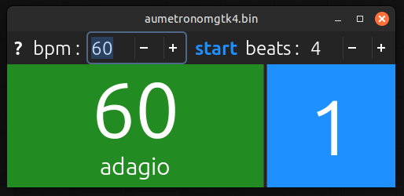

simple metronome

hover over '?' & 'bpm' & 'beats' for info / hotkeys

simpleaudio package - use 'fixed' one :

https://github.com/hamiltron/py-simple-audio/issues/72

scroll down to 'cexen' comment

same link is in 'requirements.txt'

the original simpleaudio package gives error when playing audio

you will have to build it on your system, using standard practice for building gtk(4) apps

ie needed are PyGObject & introspection & audio (alsa) libraries
